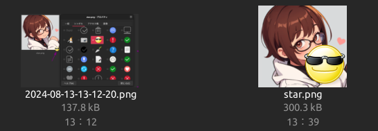
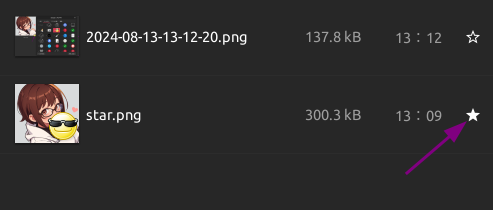
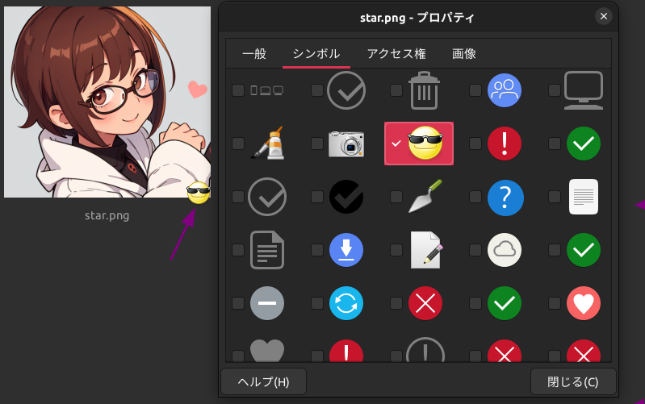
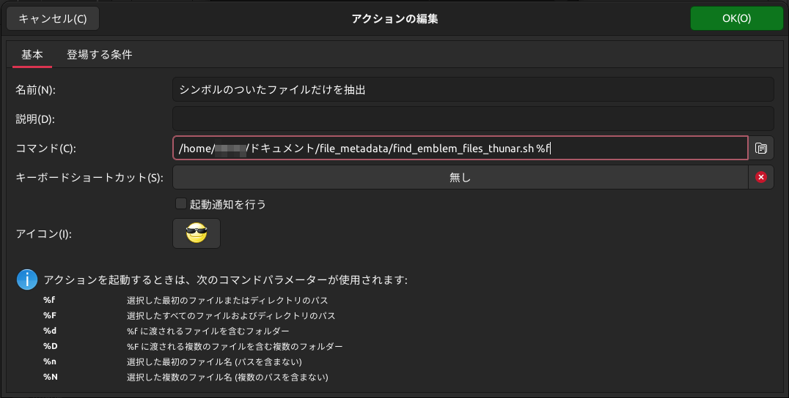
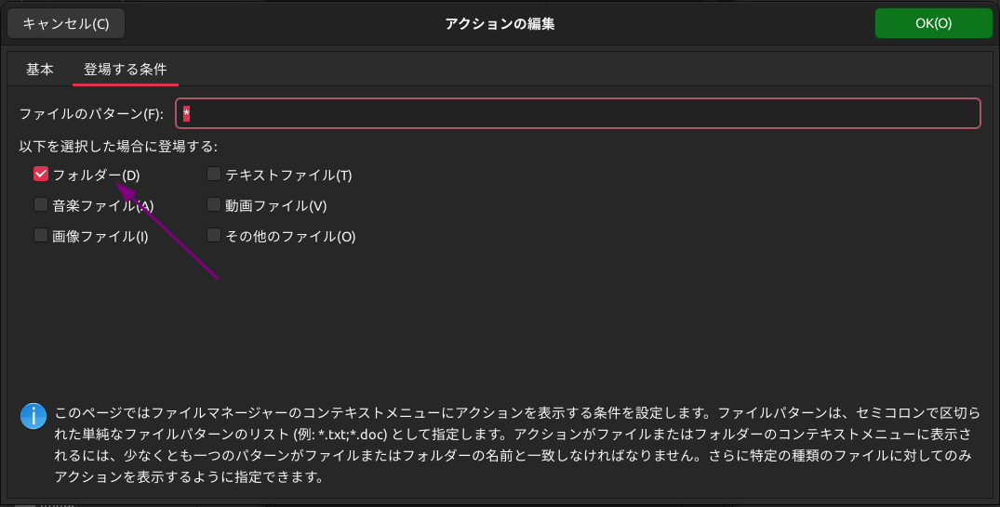

# `Ubuntu 22.04`におけるファイルマネージャーの`拡張属性`によるファイルの再帰的検索(GUI)

## はじめに
`Ubuntu 22.04`では様々なファイルマネージャーをインストールできます。
これらファイルマネージャー毎に異なる利点があることから、わたしはいくつかのファイルマネージャーを同時に使用しています。[^1]
[^1]: たとえば`nautilus`では再帰的なファイル名の検索が便利だったり、`pcmanfm-qt`では再起動後のタブ付きのウィンドウ再表示に対応しています。`Thunar`ではファイル名の一括変更に便利です。

それらのうち、
- `nautilus`のスター
- `Thunar`のシンボル（エンブレム）

について、それらを使った検索表示ができないものか気になっていました。
結論から書くと、`Nautilus`ではスターのついたファイルを検索できません。（一覧表示でスターを表示させるように設定すると、そのフォルダの並び順をスターがついているものを先頭にするような事はできますが、再帰的に検索はできません）
対して`Thunar`ではシンボルをつけたファイルの再帰的な検索が可能です。

ここでは背景情報とともに記事として公開します。


- [`Ubuntu 22.04`におけるファイルマネージャーの`拡張属性`によるファイルの再帰的検索(GUI)](#ubuntu-2204におけるファイルマネージャーの拡張属性によるファイルの再帰的検索gui)
  - [はじめに](#はじめに)
  - [`nautilus`での表示のされ方](#nautilusでの表示のされ方)
    - [`tracker3`](#tracker3)
  - [`Thunar`でのシンボルの表示のされ方](#thunarでのシンボルの表示のされ方)
    - [検索用スクリプト](#検索用スクリプト)
    - [`Thunar`のカスタムアクションとして登録する](#thunarのカスタムアクションとして登録する)
  - [おわりに](#おわりに)


## `nautilus`での表示のされ方
アイコン表示

一覧表示


`gio`コマンドや`xattr`コマンド、あるいは`attr`ユーティリティで得られるコマンド（`getfattr`コマンドなど）ではスターについてのメタデータにアクセスできません。`gvfs-info`コマンドでアクセスできるとの記述がありませんたが、`Ubuntu 22.04`のリポジトリには存在しませんでした。`gvfs-metadata`コマンドも存在しません。(universe, multiverse含む)
`nautilus`におけるスターのデータは`GVFS`によって`metadata::emblems`名前空間に保存しているようです。
それらのデータは`~/.local/share/gvfs-metadata/`ディレクトリ以下にバイナリファイルとして保存されています。
参考：
- [GNOME: Where does Nautilus store emblem data and how?](https://stackoverflow.com/questions/10874702/gnome-where-does-nautilus-store-emblem-data-and-how)
- [GVFSD-METADATA(1)](https://man.archlinux.org/man/gvfsd-metadata.1.en)
- [拡張属性](https://wiki.archlinux.jp/index.php/%E6%8B%A1%E5%BC%B5%E5%B1%9E%E6%80%A7)
- [xattr(7)](https://man.archlinux.org/man/xattr.7)

`nautilus`ではディレクトリに多数のファイルが存在する場合、他のファイルマネージャーと比較してかなり動作が重くなりますが、この原因がメタデータ（拡張属性）の処理によるものなのかもしれません。
参考：
- [Nautilus FAQ Slow Nautilus](https://wiki.debian.org/Nautilus/FAQ/SlowNautilus)

### `tracker3`
`tracker-test-utils`コマンドをインストールスルことにより、`tracker3`コマンドを利用可能になります。
例えば`tracker3 info star.png`とすると、後述する`gio info star.png`と同じように詳細な情報を得ることができます。しかしこの中に「スターがついているかどうか」を表す情報は含まれていません。
```bash
user@user:~/ドキュメント/file_metadata/assets$ tracker3 info star.png | xsel
Querying information for entity: 'star.png'
  'file:///home/user/%E3%83%89%E3%82%AD%E3%83%A5%E3%83%A1%E3%83%B3%E3%83%88/file_metadata/assets/star.png'
Results:
  'tracker:extractorHash' = 'b87eb36f02de830b63f91cc53c1a6db2b1b167622a4380961eb6775f90126cd6'
  'nfo:fileLastModified' = '2024-08-13T04:09:42Z'
  'nfo:fileName' = 'star.png'
  'nfo:fileSize' = '300323'
  'nfo:belongsToContainer' = 'urn:fileid:03d690db-6073-4ac2-a67d-d90c69aab9a7:35270024'
  'nfo:fileCreated' = '2024-08-13T04:09:42Z'
  'nfo:fileLastAccessed' = '2024-08-13T04:09:42Z'
  'nie:isPartOf' = 'urn:fileid:03d690db-6073-4ac2-a67d-d90c69aab9a7:6433807'
  'nie:isPartOf' = 'urn:fileid:03d690db-6073-4ac2-a67d-d90c69aab9a7:35270017'
  'nie:isPartOf' = 'urn:fileid:03d690db-6073-4ac2-a67d-d90c69aab9a7:35270024'
  'nie:created' = '2024-08-13T04:09:42Z'
  'nie:interpretedAs' = 'urn:fileid:03d690db-6073-4ac2-a67d-d90c69aab9a7:6459418'
  'nie:dataSource' = 'urn:fileid:03d690db-6073-4ac2-a67d-d90c69aab9a7:5767264'
  'nie:byteSize' = '300323'
  'nie:url' = 'file:///home/user/%E3%83%89%E3%82%AD%E3%83%A5%E3%83%A1%E3%83%B3%E3%83%88/file_metadata/assets/star.png'
  'http://purl.org/dc/elements/1.1/source' = 'urn:fileid:03d690db-6073-4ac2-a67d-d90c69aab9a7:5767264'
  'http://purl.org/dc/elements/1.1/date' = '2024-08-13T04:09:42Z'
  'nrl:modified' = '54'
  'nrl:added' = '2024-08-13T04:39:12Z'
  'rdf:type' = 'http://www.w3.org/2000/01/rdf-schema#Resource'
  'rdf:type' = 'http://tracker.api.gnome.org/ontology/v3/nie#DataObject'
  'rdf:type' = 'http://tracker.api.gnome.org/ontology/v3/nfo#FileDataObject'
  'nmm:dlnaMime' = 'image/png'
  'nmm:dlnaProfile' = 'PNG_LRG'
  'nfo:width' = '533'
  'nfo:height' = '493'
  'nie:isStoredAs' = 'file:///home/user/%E3%83%89%E3%82%AD%E3%83%A5%E3%83%A1%E3%83%B3%E3%83%88/file_metadata/assets/star.png'
  'nie:mimeType' = 'image/png'
  'nrl:modified' = '54'
  'nrl:added' = '2024-08-13T04:09:43Z'
  'rdf:type' = 'http://www.w3.org/2000/01/rdf-schema#Resource'
  'rdf:type' = 'http://tracker.api.gnome.org/ontology/v3/nie#InformationElement'
  'rdf:type' = 'http://tracker.api.gnome.org/ontology/v3/nfo#Media'
  'rdf:type' = 'http://tracker.api.gnome.org/ontology/v3/nfo#Visual'
  'rdf:type' = 'http://tracker.api.gnome.org/ontology/v3/nfo#Image'
  'rdf:type' = 'http://tracker.api.gnome.org/ontology/v3/nmm#Photo'
```

`tracker3 sparql`を使えば、あるいはスターがつけられているかどうかを検索できるかも知れません。しかしわたしの能力を超えるのでここでは扱いません。
参考：
- [TRACKER3-SPARQL(1)](https://man.archlinux.org/man/tracker3-sparql.1.en)

## `Thunar`でのシンボルの表示のされ方




`nautilus`でのスターに関する属性情報のアクセスのしにくさと対象的に、`Thunar`におけるシンボルの属性情報については`gio info`コマンドで簡単に確認することができます。

```bash
user@user:~/ドキュメント/file_metadata/assets$ gio info star.png | xsel

表示名: star.png
編集名: star.png
名前: star.png
種類: regular
サイズ:  300323
URI: file:///home/user/%E3%83%89%E3%82%AD%E3%83%A5%E3%83%A1%E3%83%B3%E3%83%88/file_metadata/assets/star.png
ローカルパス: /home/user/ドキュメント/file_metadata/assets/star.png
unix mount: /dev/nvme0n1p2 / ext4 rw,relatime,errors=remount-ro
属性:
  standard::type: 1
  standard::name: star.png
  standard::display-name: star.png
  standard::edit-name: star.png
  standard::copy-name: star.png
  standard::icon: image-png, image-x-generic, image-png-symbolic, image-x-generic-symbolic
  standard::content-type: image/png
  standard::fast-content-type: image/png
  standard::size: 300323
  standard::allocated-size: 303104
  standard::symbolic-icon: image-png-symbolic, image-x-generic-symbolic, image-png, image-x-generic
  etag::value: 1723522182:927808
  id::file: l66306:6459418
  id::filesystem: l66306
  access::can-read: TRUE
  access::can-write: TRUE
  access::can-execute: FALSE
  access::can-delete: TRUE
  access::can-trash: TRUE
  access::can-rename: TRUE
  time::modified: 1723522182
  time::modified-usec: 927808
  time::access: 1723523952
  time::access-usec: 666366
  time::changed: 1723523952
  time::changed-usec: 646366
  time::created: 1723522182
  time::created-usec: 815809
  unix::device: 66306
  unix::inode: 6459418
  unix::mode: 33204
  unix::nlink: 1
  unix::uid: 1000
  unix::gid: 1000
  unix::rdev: 0
  unix::block-size: 4096
  unix::blocks: 592
  owner::user: user
  owner::user-real: user
  owner::group: user
  thumbnail::path: /home/user/.cache/thumbnails/large/3f745d67dd3076c941d85afd04133e8d.png
  thumbnail::is-valid: TRUE
  metadata::emblems: [emblem-cool]    # <- これ。
```

この情報を使って、`metadata::emblems`に情報が付与されているファイルを検索することができます。

### 検索用スクリプト
```bash
#!/bin/bash

# 検索を開始するディレクトリを指定
DIRECTORY=${1:-.}

# ディレクトリを再帰的に検索し、metadata::emblemsが設定されているファイルを表示
find "$DIRECTORY" -type f | while read -r file; do
    if gio info -a "metadata::emblems" "$file" | grep -q "metadata::emblems"; then
        echo "$file"
    fi
done
```
これを実行するとシンボルをつけたファイルを再帰的に捜査しリストされます。
```bash
# 使い方
user@user:~/ドキュメント/file_metadata$ ./metadata.sh ./
./assets/star.png
user@user:~/ドキュメント/file_metadata$
```

### `Thunar`のカスタムアクションとして登録する
```bash: find_emblem_files_thunar.sh
#!/bin/bash

# 検索するディレクトリ（Thunarから渡される）
DIRECTORY="$1"

# 一時的なディレクトリを作成して、検索結果を保存
TEMP_DIR=$(mktemp -d)

# シンボルが付けられたファイルを検索し、結果を一時ディレクトリにシンボリックリンクとして保存
find "$DIRECTORY" -type f | while read -r file; do
    if gio info -a "metadata::emblems" "$file" | grep -q "metadata::emblems"; then
        ln -s "$file" "$TEMP_DIR/$(basename "$file")"
    fi
done

# Thunarで検索結果を表示
thunar "$TEMP_DIR"

```
このようなスクリプトを作成し、これをカスタムアクションに登録します。
- カスタムアクションに登録

- カスタムアクションの出現条件を設定

- 実行結果


成功です。

## おわりに
スターやシンボル周りの周辺情報が手に入りましたし、結果的に便利機能がひとつふえました。
よろしかったらご参考にしてください。

ありがとうございました。


